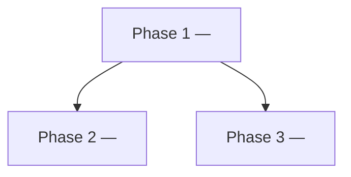

# Phases — <project / feature>

Written by `phases`. The durable plan `issues` and `plan-parallelize` consume.

## Phase list
### Phase <n> — <name>
- **Goal:** <one sentence>
- **Deliverables:** <what exists when this phase is done>
- **Depends on:** <phase ids, or `none`>
- **Blocks:** <phase ids>
- **Parallel-safe with:** <phase ids that touch no shared files>
- **Files/modules touched:** <the edit surface — used to detect track conflicts>
- **Exit criteria:** <observable proof this phase is done>

## Dependency graph

## Wave table
Phases in the same wave have no dependency **and** no file overlap, so they can run concurrently.

| Wave | Phases | Runs concurrently | Shared-file conflicts |
|------|--------|-------------------|-----------------------|
| 1 | | | none |
| 2 | | | |
